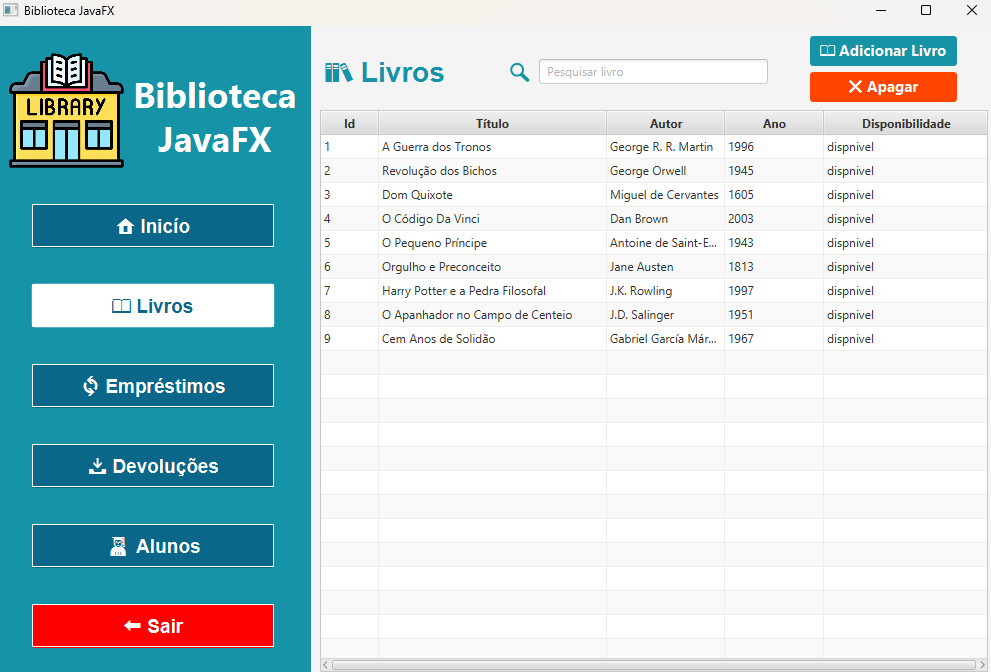

# 📚 Sistema de Gerenciamento de Biblioteca (JavaFX)

<p align="center">
  
  
</p>


Este projeto é um **Sistema de Gerenciamento de Biblioteca Desktop**, desenvolvido em **Java com JavaFX** e banco de dados **MySQL**, seguindo o padrão **MVC (Model–View–Controller)**.

O sistema permite o controle completo de alunos, livros, empréstimos e devoluções, além de exibir um **dashboard** com informações gerais da biblioteca.

---

## 🖥️ Funcionalidades

- 📘 Cadastro de livros  
- 👨‍🎓 Cadastro de alunos  
- 🔄 Empréstimo de livros  
- 📥 Devolução de livros  
- 📊 Dashboard com indicadores:
  - Total de livros cadastrados
  - Total de alunos cadastrados
  - Livros pendentes de devolução  

---

## 🧱 Tecnologias Utilizadas

- **Java 17**
- **JavaFX**
- **FXML**
- **MySQL**
- **JDBC**
- **Maven**
- **Padrão MVC**
- **Scene Builder** (opcional)

---

## 📂 Estrutura do Projeto

```text
src/
 └── main/
     ├── java/
     │   └── com.felipemeireles.sistemadebiblioteca
     │       ├── controller
     │       ├── dao
     │       ├── database
     │       └── entity
     └── resources/
         └── com.felipemeireles.sistemadebiblioteca
             ├── img
             └── view
```

---

## 🎯 Objetivo do Projeto

Este projeto foi desenvolvido com o objetivo de:

- Aplicar Programação Orientada a Objetos na prática  
- Utilizar o padrão MVC em aplicações desktop  
- Trabalhar com JavaFX e FXML  
- Integrar Java com banco de dados MySQL  
- Criar um projeto completo para portfólio no GitHub  

---

## ⚙️ Pré-requisitos

Antes de executar o projeto, certifique-se de ter instalado:

- **Java JDK 17 ou superior**
- **MySQL Server**
- **Git**
- Uma IDE Java (IntelliJ IDEA, Eclipse ou NetBeans)

---

## 🗄️ Banco de Dados

O sistema utiliza **MySQL**.  
Siga os passos abaixo para criar o banco e as tabelas corretamente.

### 📌 Criar o banco de dados

```sql
CREATE DATABASE DB_BIBLIOTECA;
USE DB_BIBLIOTECA;
```

### 📌 Criar as tabelas

```sql
CREATE TABLE livros (
    id INT AUTO_INCREMENT PRIMARY KEY,
    titulo VARCHAR(255) NOT NULL,
    autor VARCHAR(255) NOT NULL,
    ano INT,
    disponibilidade VARCHAR(255) NOT NULL
);

CREATE TABLE alunos (
    id INT AUTO_INCREMENT PRIMARY KEY,
    nome VARCHAR(255) NOT NULL,
    email VARCHAR(255) NOT NULL,
    cpf VARCHAR(14) NOT NULL UNIQUE,
    telefone VARCHAR(255) NOT NULL
) ENGINE=InnoDB;

CREATE TABLE emprestimos (
    id INT AUTO_INCREMENT PRIMARY KEY,
    aluno_cpf VARCHAR(14) NOT NULL,
    livro_id INT NOT NULL,
    data_emprestimo DATE NOT NULL,
    data_devolucao DATE NOT NULL,
    status VARCHAR(20) DEFAULT 'EM_ABERTO',
    FOREIGN KEY (aluno_cpf) REFERENCES alunos(cpf),
    FOREIGN KEY (livro_id) REFERENCES livros(id)
) ENGINE=InnoDB;
```

### 📌 Consultas úteis

```sql
SELECT * FROM livros;
SELECT * FROM alunos;
SELECT * FROM emprestimos;
```

---

## 🔌 Configuração da Conexão com o Banco

Configure corretamente a classe de conexão JDBC com os dados do seu MySQL (src/main/java/com/felipemeireles/sistemadebiblioteca/database/ConexaoMySQL.java):

```java
String url = "jdbc:mysql://localhost:3306/DB_BIBLIOTECA";
String usuario = "root";
String senha = "sua_senha";
```

---

## 🚀 Como Executar o Projeto

### 1️⃣ Clonar o repositório

```bash
git clone https://github.com/seu-usuario/seu-repositorio.git
```

### 2️⃣ Importar na IDE

- Abra sua IDE
- Selecione **Import Project**
- Escolha o projeto Maven
- Aguarde o download das dependências

### 3️⃣ Executar a aplicação

- Execute a classe principal do projeto (src/main/java/com/felipemeireles/sistemadebiblioteca/Application.java)
- O sistema será iniciado com a interface gráfica

---

## 📌 Observações

- Projeto desenvolvido com JavaFX + FXML  
- Scene Builder pode ser usado para editar telas  
- DAOs são responsáveis pelo acesso ao banco  
- Código organizado seguindo MVC  

---

## 🔮 Melhorias Futuras

- Sistema de login
- Relatórios em PDF
- Histórico de empréstimos
- Validações avançadas
- Interface mais moderna

---

## 👨‍💻 Autor

Felipe Meireles  
Estudante de Sistemas de Informação  
Desenvolvedor Java  

---
